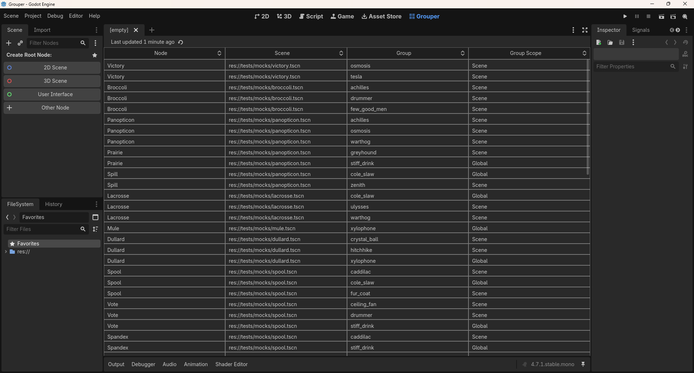

  <picture>
    <source srcset="/docs/media/grouper_logo_light.png" media="(prefers-color-scheme: light)" />
    <source srcset="/docs/media/grouper_logo_dark.png" media="(prefers-color-scheme: dark)" />
    
  </picture>

# Grouper for Godot 4.7
Grouper is a Godot 4.7 addon that finds every node added to any group and displays them in a table with the node's name, scene path, group name, and group scope as columns.

## How to Use
- To add a node to the table:
  - In editor:
    <ol type="1">
      <li>Use the <i>Groups</i> dock</li> 
      <li>Save the scene</li> 
      <li>Click the table's refresh button</li>
    </ol>
  - In code:
    <ol type="1">
      <li>Use <code>add_to_group</code> with <b>persistent</b> set to <i>true</i></li>
      <li>Play the scene</li>
      <li>Click the table's refresh button</li>
    </ol>

- To sort the able:
  <ol type="1">
    <li>Press any column header for ascending order</li>
    <li>Press the same header again for descending order</li>
  </ol>

## License
Copyright &copy; 2026 Chris "C.J." Irwin 
This project is [MIT](LICENSE) licensed.
